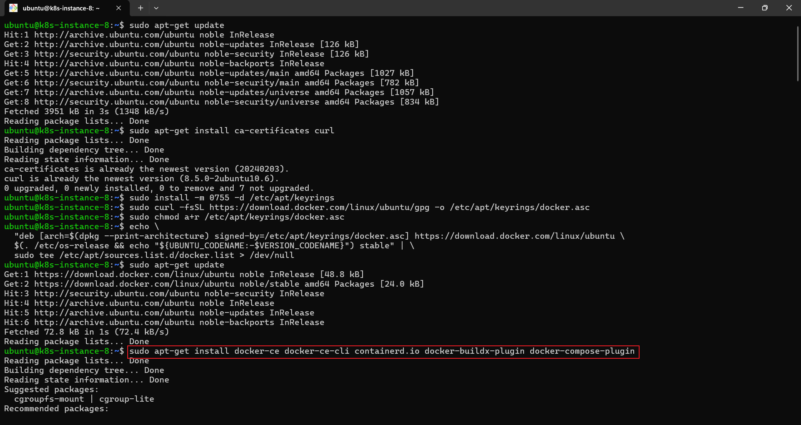
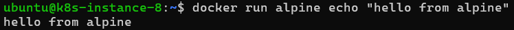

# Homework 1 - Docker Core Concepts

## Exercises

### Exercise 1

1. Install Docker Engine using the official Docker APT repository

2. Enable and start the Docker service

3. Print the info of the Docker Client and Server

### Exercise 2

1. Search for the official repos of Ubuntu, Alpine, and Nginx

2. Run an Nginx container using the image from the official repo

### Exercise 3

1. Check Docker daemon status

2. Stop the Docker daemon

3. Run a container while it's stopped

4. Restart the Docker daemon and run a container again

### Exercise 4

1. Run an Ubuntu container interactively

2. Use `apt update && apt install curl` inside the container

3. Exit the container

### Exercise 5

1. List running container

2. List all containers (including exited)

### Exercise 6

1. Run a container in the background

2. Then Pause it

3. Unpause it

4. Stop it

5. Restart it

6. Kill it

### Exercise 7

- Remove a running container

### Exercise 8

1. Pull the `alpine` and `ubuntu` images

2. List all the container images in your Docker Host

### Exercise 9

1. Run `alpine` and execute `echo "hello from alpine"`

2. Run `busybox` and execute `uname -a`

3. List all the containers

### Exercise 10

1. Remove all stopped containers

2. Remove unused images

I use the `-a` flag because without it, the command doesn't remove the images

3. Inspect Docker disk usage

