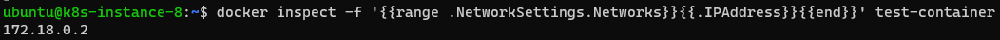
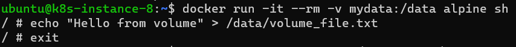
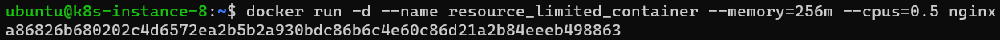

# Homework 2 - Docker Extended Topics

## Exercise 1

1. List all Docker networks

2. Inspect the default `bridge` network

3. Create a new bridge user-defined network

4. Run a container attached to it and inspect its IP

## Exercise 2

1. Run two Nginx containers which have to be connected to that user-defined network created
in Exercise 1

2. Use ping within both containers to test communication each other by container name

## Exercise 3

1. Create a Docker volume: `mydata`

2. Run a container using the volume

3. Write a file inside `/data` from the container, then:

  1. Stop the container.

  

  2. Relaunch to verify persistence.

  

## Exercise 4

1. Create a directory on your host

2. Run a container with a bind mount

3. Create a file in `/mnt` from the container and check the host

## Exercise 5

1. Create a file in a named volume

2. Create a file using a bind mount

3. Observe where data is stored on the host with `docker volume inspect` and `ls`

## Exercise 6

1. Run an Ubuntu container with the necessary options to enable Docker in Docker (DinD)

2. Exec into the container and run `docker version`

## Exercise 7

1. Run a container with memory and CPU limits:
    - Memory = 256m
    - CPU = 0.5

2. Check resource usage stats

3. Check disk usage (docker system)

## Exercise 8

1. Run a container with policy `--restart on-failure`

2. Kill the container and observe how it restarts

3. Try with the policy `--restart unless-stopped`

4. Reboot the system and see what happens

## Exercise 9

1. Create a network `dbnet`
2. Create a volume `dbdata`
3. Run a MariaDB container with the following requirements:
    - Attached to volume `dbdata`
    - Attached to network `dbnet`
    - Do NOT expose ANY port

## Exercise 10

Run a PHPMyAdmin container with the following requirements:

1. Attached to network `dbnet` (created in Exercise 9)
2. Use a bind mount to persist the web app configuration
3. Linked to the previous MariaDB container (created in Exercise 9)

4. Open a browser to display the PHPMyAdmin Login Form.

5. Login with the DB credentials

