# Homework 3 - Building Images

## Exercise 1: Build and Containerize an API (Back-End)

Develop a simple API using a programming language of your choice (e.g., Node.js, Python, Go).

- The API must expose an endpoint (e.g., `/info`) that returns:
  - The container's hostname
  - The container's IP address

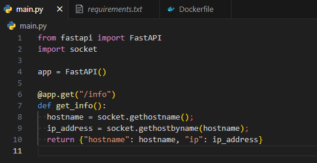

- Write a Dockerfile using multistage build to containerize the API.

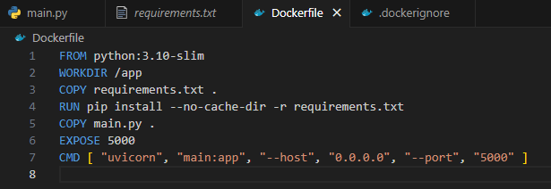

- Build the image and run the container.

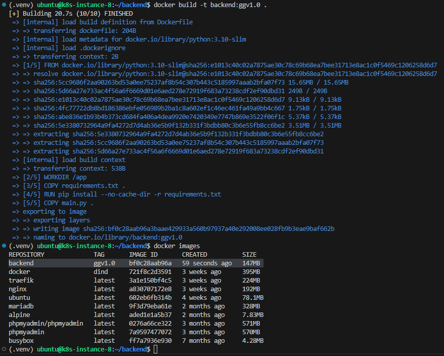

- Test the endpoint with curl to verify that it returns the correct information.

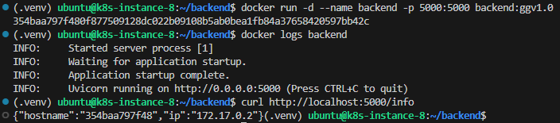

- Ensure the API is not exposed to the host.

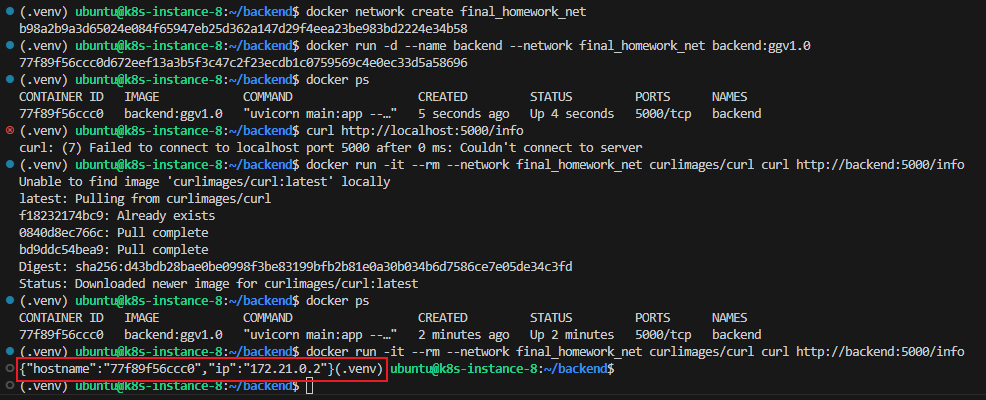

## Exercise 2: Build and Containerize a Front-End Application

- Create a front-end application using HTML/JavaScript or a framework of your choice.
- The app must fetch the `/info` endpoint from the backend API and display the hostname and IP address.

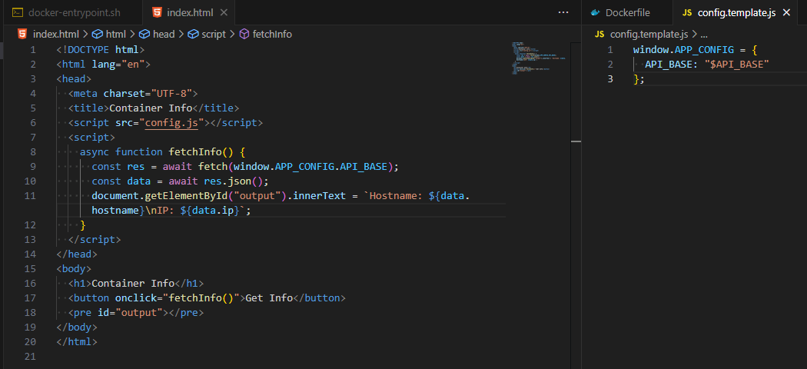

- Write a Dockerfile using multistage build to containerize and minimize the final image.

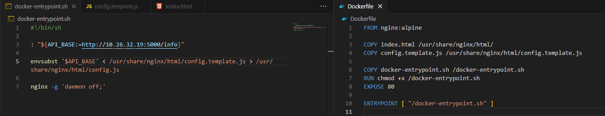

- Create a user-defined Docker network and run both frontend and backend containers within it.

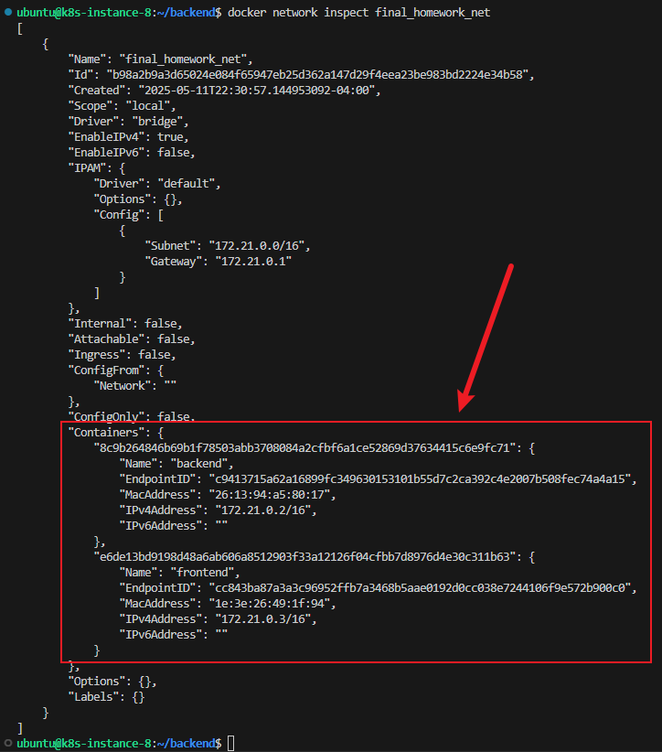

- Verify in the browser that the frontend correctly shows the container metadata served by the Back-End.

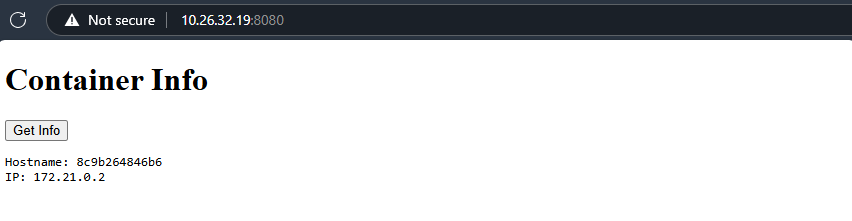

## Exercise 3: The `.dockerignore` File

Create a `.dockerignore` file in both Back-End and Front-End repos to exclude all unnecessary files and directories when building.

### Backend

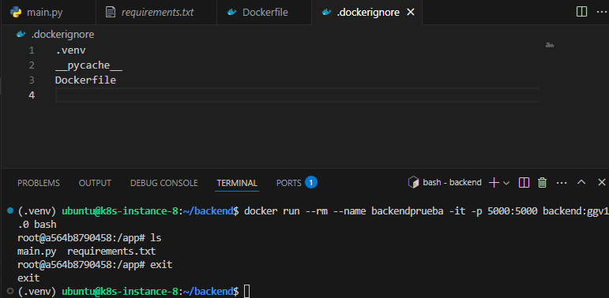

### Frontend

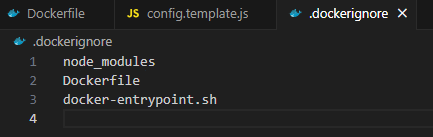

## Exercise 4: Private Registry

- Push the previously built Back-End and Front-End images to the private registry at `docker.jala.pro`

- Tag your images: `docker.jala.pro/docker-training/[CONTAINER-NAME=BackEnd ||
FrontEnd]:[TAG=FullName]`
  - For Instance: `docker.jala.pro/docker-training/backend:calebespinoza`

